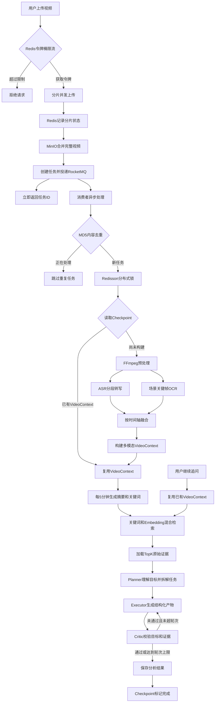

<div align="center">
  <a href="https://github.com/Xiaoc7r/DOVideo-AI">
  </a>

  <h1 align="center">DoVideoAI - 智能视频内容理解平台</h1>
  
  <p align="center">
    <strong> 稳定视频接入 / 多模态内容理解 / 目标驱动 Agent 分析 </strong>
  </p>

  <p align="center">
    <a href="https://github.com/Xiaoc7r/DOVideo-AI">
      
    </a>
    <a href="https://github.com/Xiaoc7r/DOVideo-AI">
      
    </a>
    <a href="https://github.com/Xiaoc7r/DOVideo-AI">
      
    </a>
    <a href="https://github.com/Xiaoc7r/DOVideo-AI">
      
    </a>
    <a href="https://github.com/Xiaoc7r/DOVideo-AI">
      
    </a>
  </p>
</div>

<br/>

<br/>

**DoVideoAI** 是一个面向长视频内容理解的 **Video Agent** 平台。

**DoVideoAI** 集成了用户鉴权、分片上传、音频提取、文字转写、多模态解析及 AI 结构化产物生成。

针对视频处理场景中常见的 **长耗时阻塞、高并发资源冲突、大文件传输不稳定** 等痛点，基于 **RocketMQ + Redisson + 分片续传** 重构了系统架构。

针对视频的音像信息获取复杂，采取并行提取语音和视觉信息的方式，语音侧通过 ASR 生成带时间范围的转写文本，视觉侧通过关键帧 OCR 提取字幕、PPT 和代码等画面内容，再按时间轴构建统一的多模态 **VideoContext**。在此基础上，系统通过 **Planner-Executor-Critic** 受控 Agent 工作流理解用户目标、拆解任务、检索证据、生成结构化产物并校验结论。用户可以基于已经解析的视频内容继续追问，无需重新执行完整的视频预处理。

视频平台大多只解决了**存储**和**播放**的问题，DoVideoAI 旨在解决“理解”的问题，利用 AI 提取核心价值，让视频不再是黑盒。


<br/>

## 项目预览


<br/>

##  核心功能

### 1. 🚀 稳定上传体验

**分片断点续传：** 针对 GB 级大文件，前端将视频切分为多个分片，通过 Redis 维护分片上传状态，网络中断后只需补传缺失部分。

**异步任务提交：** 引入 RocketMQ 将视频解析任务从请求线程中剥离。视频合并完成后，接口只负责创建任务并投递消息，后续处理全部交由消费者异步完成。

### 2. 🛡️ 高并发防护

**内容级去重：** 使用视频 MD5 构建内容指纹，通过 Redisson 分布式锁控制相同视频的并发解析，避免重复任务争抢视频处理资源。

**消费幂等：** 按视频任务和用户分析目标记录完成状态，RocketMQ 重复投递时直接复用已有执行结果。

**削峰与重试：** Controller 层使用 Redis 令牌桶控制 AI 请求速率，第三方 ASR 和大模型接口异常时通过指数退避机制进行有限重试。

### 3. 🎬 多模态 VideoContext

系统使用 FFmpeg 提取音频，并通过场景变化检测抽取关键帧。

音频按照固定时间窗口切分后执行 ASR，生成带开始时间和结束时间的 transcript。关键帧经过 OCR 后记录画面文字、帧文件及对应时间戳。

ASR 与关键帧 OCR 并行执行，最终按照时间窗口合并为统一的 `VideoSegment`：

```text
[02:00 - 02:30]

ASR：接下来讲解二叉树的前序遍历
OCR：前序遍历：根节点、左子树、右子树
证据：frame_125000.jpg
```

多个 `VideoSegment` 共同组成多模态 `VideoContext`，供 Agent 检索、引用和校验。

### 4. 🤖 受控 Agent 工作流

系统采用 **Planner-Executor-Critic** 工作流：

- **Planner：** 理解用户目标，并拆解为 3 到 5 个可执行任务。
- **Executor：** 根据任务检索视频证据，生成结论、建议及时间戳引用。
- **Critic：** 检查目标覆盖、证据一致性和结构完整性。
- **定向重生成：** Critic 未通过时，将具体反馈交还 Executor 修正，最多执行两轮。

相比单次 Prompt 总结，受控 AgentLoop 可以明确记录任务计划、中间产物、校验反馈和当前执行轮次。

最终结果按照固定结构输出：

```json
{
  "title": "视频分析标题",
  "conclusions": ["主要结论"],
  "evidence": [
    {
      "timestampMs": 120000,
      "source": "ASR",
      "content": "对应的视频证据"
    }
  ],
  "suggestions": ["后续建议"]
}
```

### 5. 🔍 长视频上下文压缩

针对长视频，系统按照每 5 分钟构建一个语义块，并生成：

- `segmentSummary`：片段摘要
- `keywords`：片段关键词
- `startTime/endTime`：时间范围
- `rawSegments`：原始 ASR、OCR 和关键帧证据
- `embedding`：片段语义向量

Agent 默认只检索压缩后的摘要和关键词，通过 **关键词匹配 + Embedding 余弦相似度** 完成混合排序，再加载 TopK 相关片段的原始证据。

该机制减少无关上下文对模型的干扰，也避免将完整长视频文本一次性发送给大模型。

### 6. 💾 阶段级 Checkpoint

长视频解析包含多个高耗时步骤，任意步骤失败后从头执行会造成大量重复计算。

系统通过 Redis 保存以下阶段状态及中间产物：

```text
CONTEXT_COMPLETED
PLAN_COMPLETED
CRITIC_COMPLETED
ANALYSIS_COMPLETED
```

任务恢复时优先读取最近成功阶段：

- 已生成 VideoContext：跳过 ASR 和 OCR。
- 已完成 Planner：复用任务规划。
- 已产生 Critic 反馈：保留校验结果。
- 已完成分析：直接返回结构化产物。

Checkpoint 按“视频 ID + 用户目标”隔离，同一个视频可以根据不同提示词生成不同分析结果。

### 7. 💬 基于视频内容继续追问

视频首次解析完成后，系统保存多模态 VideoContext。

用户继续追问时，只需将新问题作为 Agent 目标，复用已有 VideoContext，再次经过检索、Planner、Executor 和 Critic 工作流，无需重新执行视频上传、ASR 和 OCR。

<br/>

## 技术栈

### 后端

SpringBoot + RocketMQ + Redis + MySQL + MyBatis Plus + MinIO + FFmpeg + LangChain4j

### AI

ASR + OCR + DeepSeek + Embedding + Planner-Executor-Critic

### 部署

Docker + Docker Compose

### 前端

Vue 3 + Vite 

<br/>
简易流程图



<br/>

## 我的开发环境 

| 组件 | 版本 | 备注 |
| :--- | :--- | :--- |
| **JDK** | 21.0.8 | 支持 Spring Boot 3 即可 |
| **Node** | v22.18.0 | 前端构建依赖 |
| **MySQL** | 8.0 | Docker 镜像 `mysql:8.0` |
| **Redis** | Latest (7.x) | Docker 镜像 `redis:latest` |
| **RocketMQ** | 4.9.4 | Docker 镜像 `apache/rocketmq:4.9.4` |
| **LangChain4j** | DeepSeek | 硅基流动送14元免费额度 |
| **FFmpeg** | Latest | 推荐 2025 年后的 Snapshot 版本 |
| **yt-dlp** | Latest | 建议定期 `update` 保持解析库最新 |

<br/>


## 如何本地部署 

### 中间件部署 (Docker Compose)
本项目依赖多个中间件封装为 Docker Compose 文件。


```bash
# 在项目的根目录下，直接一键启动所有服务
docker-compose up -d
```


### 后端配置修改

在启动后端前，还原以下配置：
#### 1. 配置数据库密码
确保与 docker-compose 中的 MySQL 密码一致：
```properties
spring.datasource.password=root
```

#### 2. 配置AI模型密钥
请填入你自己的 API Key：
```properties
# 不知道api是什么？可以前往 [https://cloud.siliconflow.cn/] 申请密钥，主要也有免费额度
ai.deepseek.api-key=sk-你的密钥xxxxxxxxxxxxxxxx
```

#### 3. 配置 FFmpeg 和 yt-dlp，并填入路径：
```properties
# Windows 环境示例 (注意使用斜杠 /)
tool.ffmpeg.dir=D:/ffmpeg/bin
tool.ytdlp.path=D:/yt-dlp/yt-dlp.exe

# Mac/Linux 环境示例
# tool.ffmpeg.dir=/usr/local/bin
# tool.ytdlp.path=/usr/local/bin/yt-dlp
```

### 启动项目

🟢 启动后端

```properties

cd server

# 启动服务
mvn clean spring-boot:run
# 当看到控制台输出 Started DOVideoApplication in x.xxx seconds 即表示后端启动成功。
```

🔵 启动前端

```properties

cd client
# 1. 安装依赖
npm install

# 2. 启动开发模式
npm run dev
```


访问前端界面内显示地址（默认为接口http://localhost:5173
可成功访问该项目！


<br/>

## 贡献与支持
如果这个项目对你有帮助，请给个 Star ⭐️⭐️⭐️⭐️⭐️！
